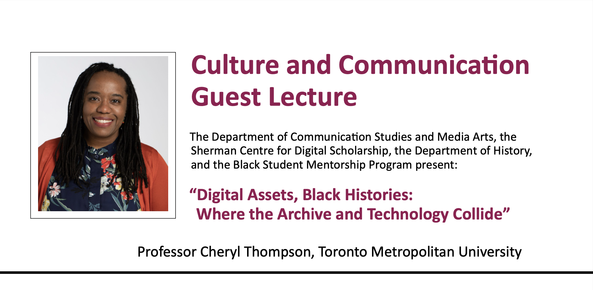

# Digital Assets, Black Histories: Where the Archive and Technology Collide

McMaster’s Department of Communication Studies and Media Arts and Sherman Centre for Digital Scholarship present the Culture and Communication Guest Lecture, “Digital Assets, Black Histories: Where the Archive and Technology Collide.”

Past research and pedagogy on Canadian digital culture has not considered Black histories. By examining the literature on digital assets (which includes sub-fields like digital research infrastructure, research data management, geographic information systems, and content management systems) in tandem with Black Canadian history, Black Studies, and cross-disciplinary analysis, the archive presents an opportunity to disrupt disciplinary gaps, and to address epistemological racisms. This talk will examine the archive, digital assets, and provide findings from Dr. Cheryl Thompson's Mapping Ontario's Black Archive's project on Black Canadian histories in the archive.

## Facilitator Bio

Cheryl Thompson is Associate Professor of Performance at Toronto Metropolitan University, Canada Research Chair in Black Expressive Culture and CreaDvity, and director of the project Mapping Ontario’s Black Archive.

## Event Recording

<iframe height="416" width="100%" allowfullscreen frameborder=0 src="https://echo360.ca/media/34b6a8da-a121-42df-a9d7-45d2e1d9afc5/public"></iframe>
[View original here.](https://echo360.ca/media/34b6a8da-a121-42df-a9d7-45d2e1d9afc5/public)

