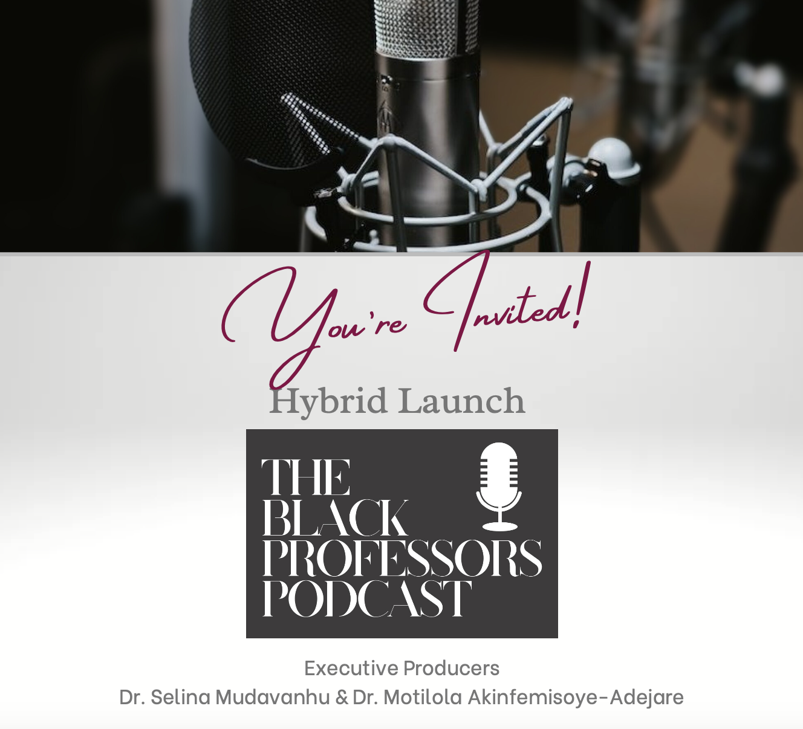

# Hybrid Launch of the Black Professors Podcast

This event is the official launch of the Black Professors Podcast, a project that started in a Zoom room as a conversation between two strangers who had been introduced to one another by a mutual colleague and mentor (Prof. Bukola Salami) in the summer of 2023.

Since this initial meeting, the founders and executive producers of the podcast, Dr. Selina Mudavanhu (Communication Studies & Media Arts, McMaster University) & Dr. Motilola Akinfemisoye-Adejare (African Studies Program, University of Calgary) have become well acquainted as they interviewed several senior Black professors in Canada with the support of students working as research and production assistants.

The podcast has received immense support from colleagues in the Pulse Lab at McMaster University and the Sherman Centre for Digital Scholarship, McMaster Library. The podcast has also received generous funding from the Arts Research Board, McMaster University.

At the launch, Black students will be in conversation with Drs. Mudavanhu and Akinfemisoye-Adejare who will discuss the criticality for the production of the Black Professors Podcast.

## Event Recording

<iframe height="416" width="100%" allowfullscreen frameborder=0 src="https://echo360.ca/media/12c4b614-58c6-4083-b0eb-100e420f2b35/public"></iframe>
[View original here.](https://echo360.ca/media/12c4b614-58c6-4083-b0eb-100e420f2b35/public)

