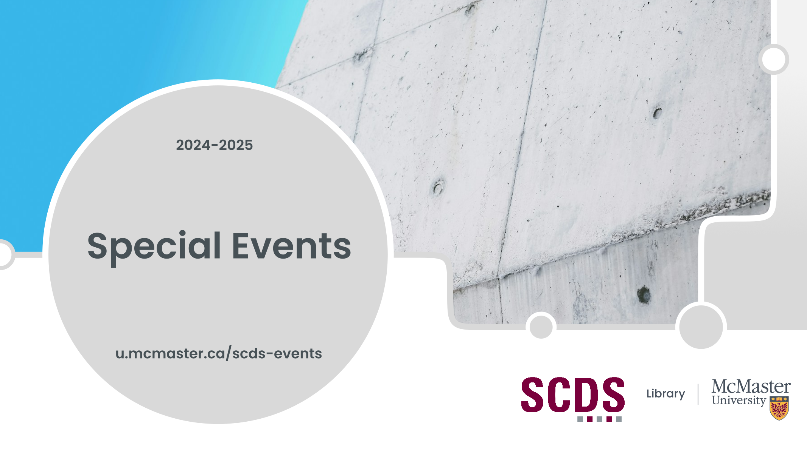



<!-- Main header -->
# Welcome to the 2024-2025 Special Events Page

This page contains event recordings of some special events that were held in the 2024-2025 year offering.

## 2024-25 Special Events

  Workshops

<ul>


<li><a href="{{workshop.url | absolute_url}}">{{workshop.title}}</a></li>


</ul>

## Land Acknowledgment

