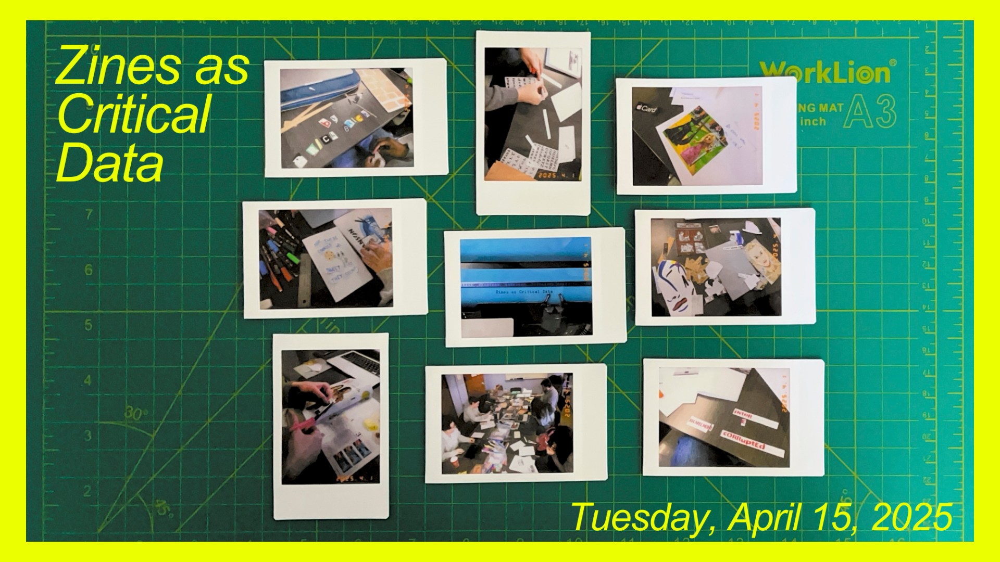

# Zines as Critical Data

In order to challenge, interrupt and reframe how data cultures are represented and understood in dominant narratives and mainstream society, this panel will present diverse zine projects that engage with data in innovative ways. A zine is a multimodal work, including text, images, and design elements, typically around sixteen to twenty pages of content on an overarching topic. Janice Radway (2011) suggests that zines produce “fluid, contradictory, even fragmented subjects” to provide alternative readings and oppositional perspectives of data environments (p. 148).  

Zines offer a unique platform for critical analysis where complex phenomena can be assessed, confronted and reimagined. In the era of Big Data, mass data collection by various bodies has become common practice. With advancements in artificial intelligence (AI), machine learning, and refined algorithms, data can be utilized in ever-expanding ways to both the benefit and detriment of corporations, governments, and citizens.  

Each zine will emphasize how data can transform in different contexts and provide a lens to explore data futures in alternative ways.  

This event explores a range of perspectives on how data is negotiated within the confines of race, ethics, representation, power, and discourse. When thinking about power we need to think about the ways of knowing and ways of being as an interconnected process. More importantly, questioning who has access to knowledge production. The diverse range of topics presented here today showcases the capacity of scholars to produce alternative data cultures that inform the present in unique ways. To present counternarratives and oppositional readings, these zine projects dynamically inform each other and offer new perspectives on seemingly normative data structures.

Presenters: 

Yun Guo, How to Build Feminist AI 

Jessica Avery, Your iPhone Needs a Facial 

Nathan Powell, Staying Safe on the Information Superhighway 

Lauren Paul, Brick by Brick 

Riley Willliamson, Are These Cookies as Sweet as They Seem? 

Serra Hasiloglu, Border Corrupted 

## Event Recording

<iframe height="416" width="100%" allowfullscreen frameborder=0 src="https://echo360.ca/media/8c34a392-6f4c-4bef-bbfb-c9dee7928463/public"></iframe>
[View original here.](https://echo360.ca/media/8c34a392-6f4c-4bef-bbfb-c9dee7928463/public)

## Event Slides

<embed src="assets/docs/Zines_Slides.pdf" style="border:none;" width="100%" height="466px">

[Download as PDF.](assets/docs/Zines_Slides.pdf)
